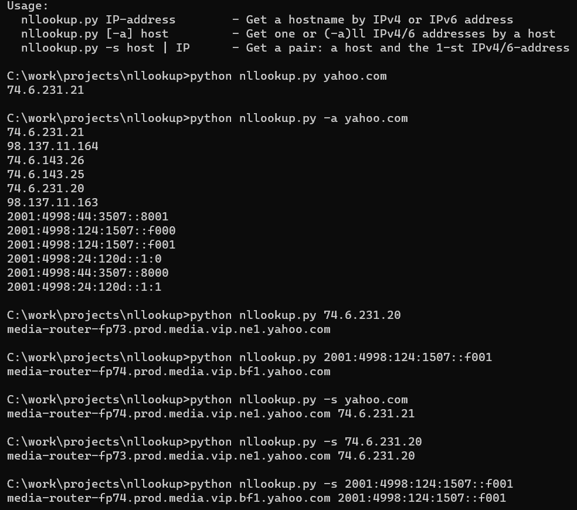

# nllookup.py

## Names Local Lookup
### Resolve names/IPs using OS resolving routines (do not make direct requests to DNS)

`Nslookup`, `host` and `dig` are commonly used to request DNS about a host or an IP-address, but sometimes it is good
to know how the OS locally resolves a name or an address. A short `Python 3` script `nllookup` should help with it.

`nllookup` runs on `*NIX` and `Windows` and works with both, IPv4 and IPv6 protocol families.

If you have an idea, a question, or found a problem, do not hesitate to open an
[issue](https://github.com/mezantrop/nllookup/issues) or mail me: Mikhail Zakharov <zmey20000@yahoo.com>
